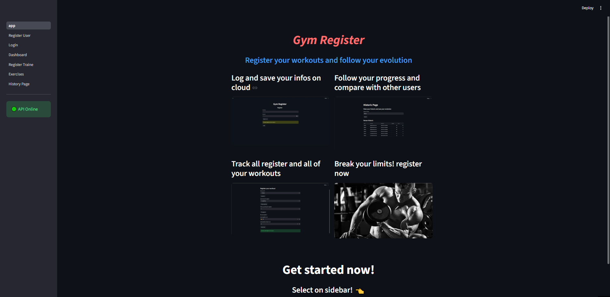
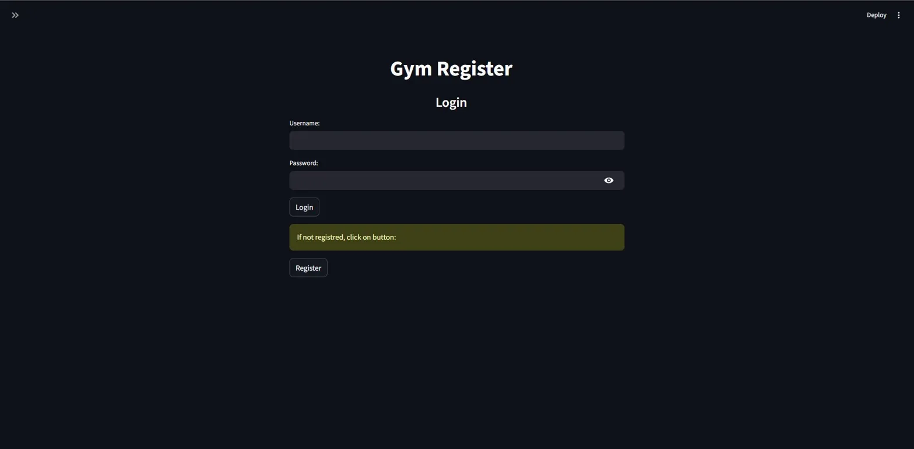
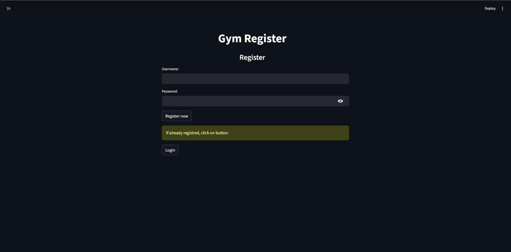
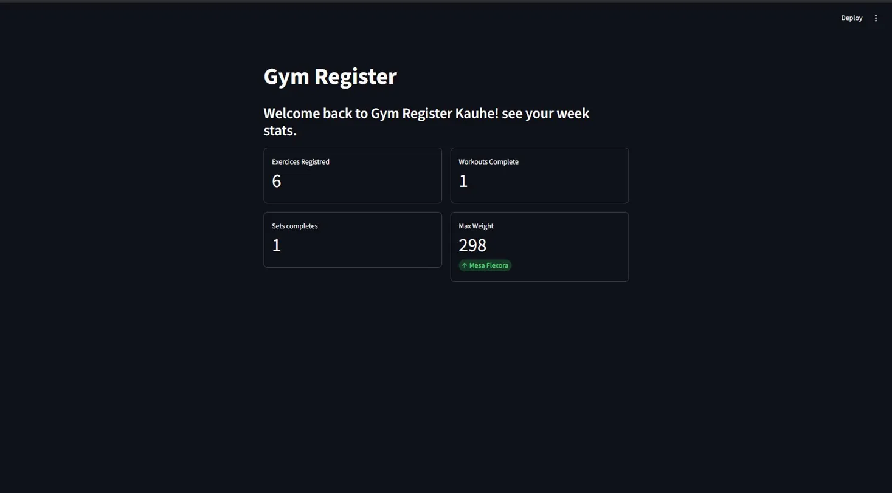
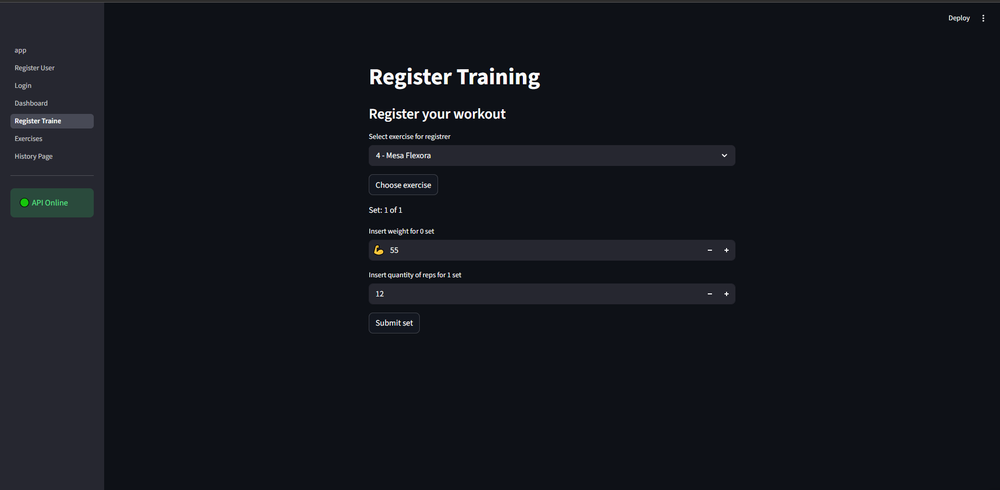
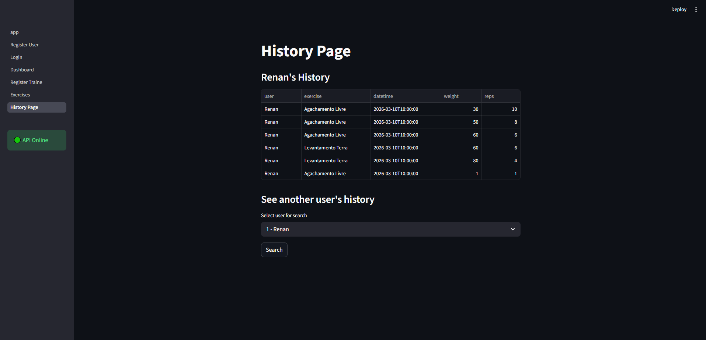
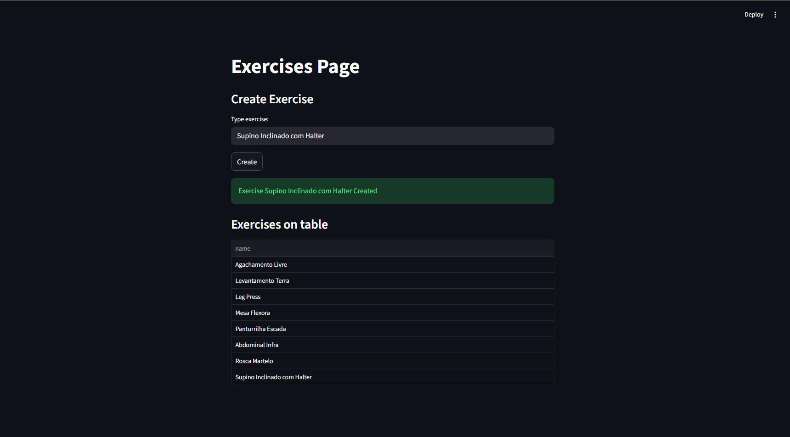

## Demo 

[Demo Do Projeto](https://gym-app-eggj82u2wknfk48seq2tmy.streamlit.app/)

---

Evolução do projeto [Gym Register](https://github.com/Renanmrqs/Gym-Register) — que começou como projeto final do curso CS50P de Harvard em CLI — agora com frontend completo em Streamlit consumindo a [Gym API](https://github.com/Renanmrqs/Gym-Api), construída com FastAPI e PostgreSQL durante o estudo do curso Introduction to SQL de Harvard.

---

## Sobre o projeto

Três fases de evolução:

- **Gym Register** — CLI em Python (CS50P final project)
- **Gym API** — API REST com FastAPI + PostgreSQL (Introduction to SQL - Harvard)
- **Gym App** — Frontend em Streamlit consumindo a API ← você está aqui

---

## Páginas

### Landpage
Pagina de inicio, apresentando o app e funcionamento para novos usuarios



### Login
Autenticação via JWT — token salvo no session_state e enviado no header das requisições protegidas. Páginas sensíveis bloqueiam acesso sem login.



### Register
Cadastro de novo usuário. Senha hasheada com Argon2 antes de ser armazenada.



### Dashboard
Visão geral dinâmica por usuário logado — exercícios cadastrados, treinos completos, séries realizadas e maior peso registrado.



### Register Training
Fluxo completo para registrar um treino: seleção do usuário, escolha do exercício, quantidade de séries, peso e reps. Requer autenticação.



### Historic
Consulta o histórico de treinos por usuário — exercício, data, peso e reps de cada série registrada, além de comparar com outros usuarios do app.



### Exercises
Cadastro e listagem de exercícios disponíveis. Requer autenticação para cadastrar.



---

## Diferenciais Técnicos

- **Arquitetura Desacoplada:** Frontend (Streamlit) e Backend (FastAPI) rodam de forma independente, comunicando-se via JSON.
- **Segurança:** Autenticação via JWT (JSON Web Tokens) e hashing de senhas com Argon2.
- **Persistência:** Integração completa com banco de dados via SQLAlchemy ORM.
- **UX:** Verificação de status da API em tempo real no sidebar.

---

## Tecnologias

- Python 
- Streamlit
- Requests

---

## Como rodar

```bash
# Crie um ambiente virtual
python -m venv venv
# Ative o ambiente

# No Windows:
.\venv\Scripts\activate
# No Linux/Mac:
source venv/bin/activate

# Instale as dependências
pip install -r requirements.txt
```

---

## API

O app consome a Gym API hospedada no Railway:

🔗 Docs da API: [docs/swagger](https://gym-api-08pc.onrender.com)

🔗 Repositório da API: [github.com/Renanmrqs/Gym-Api](https://github.com/Renanmrqs/Gym-Api)

---

## Próximos passos

- [-] Sistema de logout
- [-] Refresh token automático
- [-] Gráficos de evolução de carga por exercício
- [✅] Landpage na tela inicial apresentando o app
